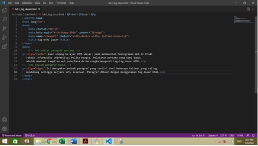
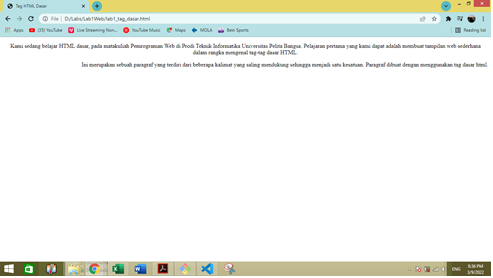
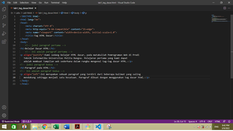
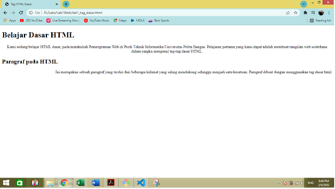
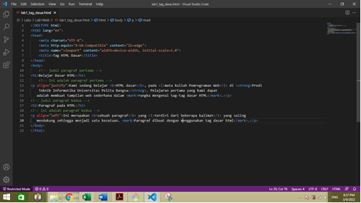
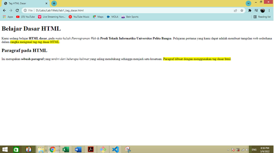

# Lab1Web
Latihan_1 9-3-2022

## Belajar tag dasar HTML

### Membuat judul Website
langkah awal dari membuat website adalah membuat judul website.
kode tag yang digunakan adalah `<title>`
berikut tampilannya

untuk kodingannya seperti ini

### Membuat paragraf
Langkah selanjutnya membuat paragraf.
kode tag yang digunakan adalah `
` untuk contoh kodingannya sebagai berikut

berikut tampilan adalah tampilan pada browser

### Mengatur atribut paragraf
Berikut kode untuk mengatur atribut paragraf / align
- Rata kanan kiri   : `
`
- Rata kanan        : `
`
- Rata kiri         : `
`
- Rata tengah       : `
`

untuk contoh kodingannya sebagai berikut

Berikut adalah tampilan pada browser, dari gambar dibawah menunjukan Paragraf Pertama menunjukan rata tengah & Paragraf kedua menunjukan rata kanan

### Memberi Judul pada setiap paragraf
Langkah selanjutnya adalah memberikan judul pada setiap paragraf, kode yang dipakai adalah `<h>` untuk contoh kodingannya sebagai berikut 

Berikut adalah tampilan pada browser, dari gambar dibawah menunjukan Paragraf Pertama berjudul **Belajar Dasar HTML** dan paragraf kedua berjudul **Paragraf pada HTML**

### Memformat Text
Pemformatan text dilakukan untuk memodifikasi tampilan text pada browser supaya tampiplan text lebih menarik

Untuk kode yang dipakai sebagai berikut :

`<b>`         : Bold text
`<strong>`    : Important text
`<i>`         :Italic text
`<em>`        :Emphasized text
`<mark>`      :Marked text
`<small>`     :Smaller text
`<del>`       :Deleted text
`<ins>`       :Inserted text
``       :Subscript text
``       :Superscript text

untuk contoh kodingannya sebagai berikut

Untuk tampilan browser nya sebagai berikut

