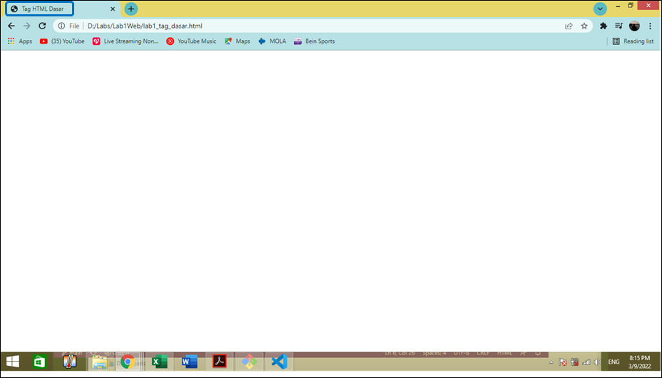
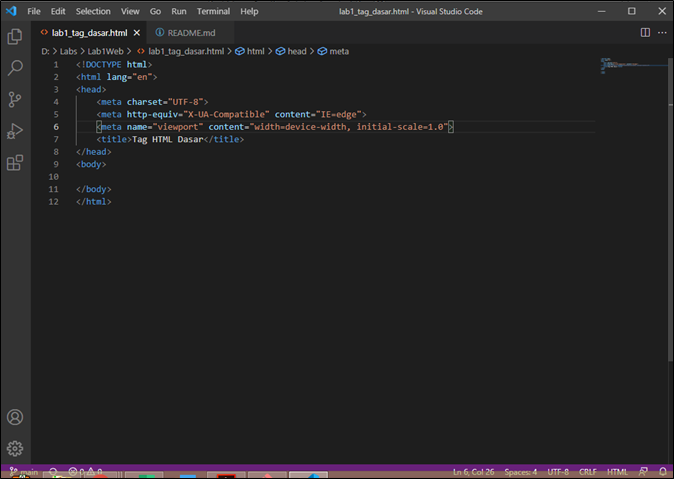
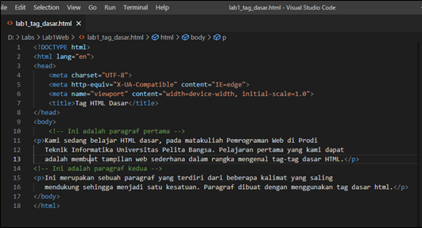
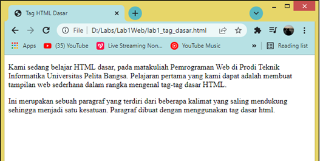

# Lab1Web
Latihan_1 9-3-2022

## Belajar tag dasar HTML

### Membuat judul Website
langkah awal dari membuat website adalah membuat judul website.
kode tag yang digunakan adalah '<title>'
berikut tampilannya

untuk kodingannya seperti ini

### Membuat paragraf
Langkah selanjutnya membuat paragraf.
kode tag yang digunakan adalah '
' untuk contoh kodingannya sebagai berikut

berikut tampilan adalah tampilan pada browser

