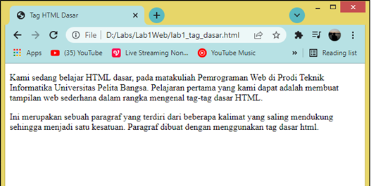

# Lab1Web
Latihan_1 9-3-2022

## Belajar tag dasar HTML

### Membuat judul Website
langkah awal dari membuat website adalah membuat judul website.
kode tag yang digunakan adalah '<title>'
 berikut tampilannya 

untuk kodingannya sebagai berikut

### Membuat Paragraf
Langkah selanjutnya adalah membuat paragraf, kode tag untuk membuat paragraf adalah '
'.
Berikut tampilannya
