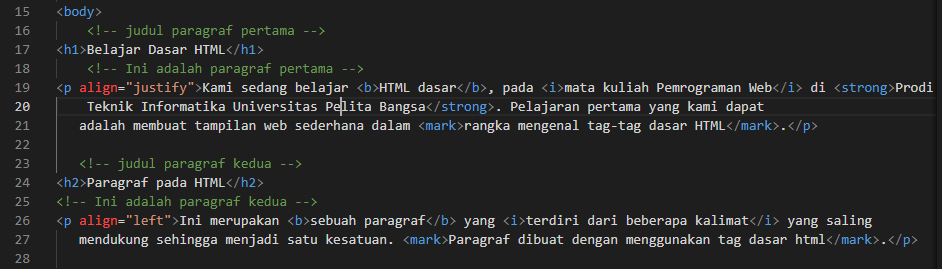
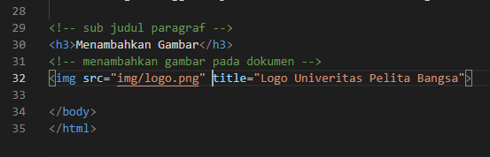
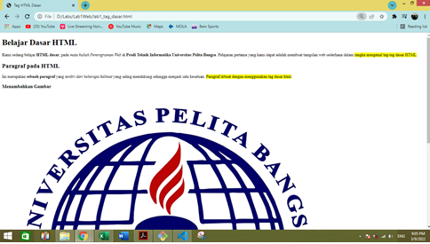
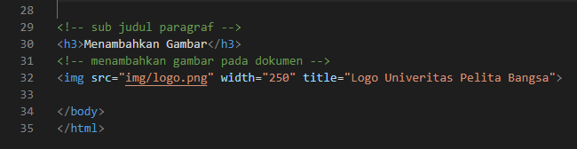
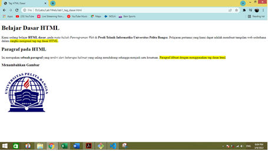
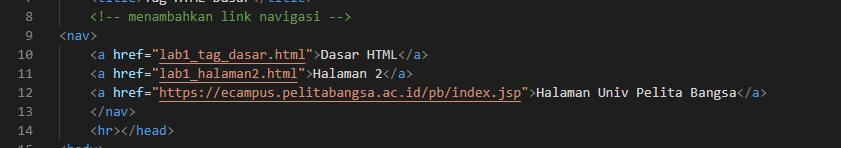
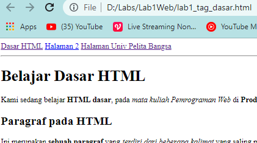

# Lab1Web
Latihan_1 9-3-2022

## Belajar tag dasar HTML

### Membuat judul Website
langkah awal dari membuat website adalah membuat judul website.
kode tag yang digunakan adalah `<title>`
berikut tampilannya

untuk kodingannya seperti ini

### Membuat paragraf
Langkah selanjutnya membuat paragraf.
kode tag yang digunakan adalah `
` untuk contoh kodingannya sebagai berikut

berikut tampilan adalah tampilan pada browser

### Mengatur atribut paragraf
Berikut kode untuk mengatur atribut paragraf / align
- Rata kanan kiri   : `
`
- Rata kanan        : `
`
- Rata kiri         : `
`
- Rata tengah       : `
`

untuk contoh kodingannya sebagai berikut

Berikut adalah tampilan pada browser, dari gambar dibawah menunjukan Paragraf Pertama menunjukan rata tengah & Paragraf kedua menunjukan rata kanan

### Memberi Judul pada setiap paragraf
Langkah selanjutnya adalah memberikan judul pada setiap paragraf, kode yang dipakai adalah `<h>` untuk contoh kodingannya sebagai berikut 

Berikut adalah tampilan pada browser, dari gambar dibawah menunjukan Paragraf Pertama berjudul **Belajar Dasar HTML** dan paragraf kedua berjudul **Paragraf pada HTML**

### Memformat Text
Pemformatan text dilakukan untuk memodifikasi tampilan text pada browser supaya tampiplan text lebih menarik

Untuk kode yang dipakai sebagai berikut :

- `<b>`         : Bold text
- `<strong>`    : Important text
- `<i>`         :Italic text
- `<em>`        :Emphasized text
- `<mark>`      :Marked text
- `<small>`     :Smaller text
- `<del>`       :Deleted text
- `<ins>`       :Inserted text
- ``       :Subscript text
- ``       :Superscript text

untuk contoh kodingannya sebagai berikut

Untuk tampilan browser nya sebagai berikut

### Menyisipkan Gambar dan Setting Size Gambar
Untuk menyisipkan gambar, siapkan gambar yang akan disisipkan pada halaman web, kemudian simpan file gambar tersebut satu folder dengan file dokumen html. Atau bisa juga menyisipkan gambar dari website external. Kode tag yang dipakai ``

untuk contoh kodingannya sebagai berikut

Untuk tampilan browser nya sebagai berikut

Gambar akan ditampilkan apa adanya sesuai dengan ukuran aslinya. Untuk mengatur ukuran gambar, dapat digunakan atribut witdh dan height dengan nilai integer yang disesuaikan. Kode tag yang dipakai ``

untuk lebih jelasnya perhatikan kodingan berikut

Untuk tampilan browser nya sebagai berikut

### Menambahkan Hyperlink
Link atau Hyperlink merupakan elemen HTML yang berfungsi untuk menghubungkan satu halaman web dengan halaman web yang lain, baik internal maupun eksternal, untuk kode tag nya `<a href="halaman web.html">Halaman web</a>`

untuk contoh kodingannya sebagai berikut

Untuk tampilan browser nya sebagai berikut

